# Flutter App

A Flutter app I've been building week by week — starting from basic screens and working up to navigation, local state management, and a live weather feature using a real API.

Each week adds something new on top of the last one, so the app has grown a bit every week rather than being built all at once.

## Tech used

- Flutter / Dart
- Provider (for state management)
- http package (for API calls)
- OpenWeatherMap API (free tier)

## Project structure

```
lib/
├── main.dart
├── theme/
│   └── app_colors.dart
├── widgets/
│   ├── CustomButton.dart
│   ├── CustomTextField.dart
│   └── ProductCard.dart
├── models/
│   ├── task.dart
│   └── weather.dart
├── providers/
│   ├── task_provider.dart
│   └── weather_provider.dart
├── services/
│   └── weather_service.dart
└── screens/
    ├── splash_screen.dart
    ├── login_screen.dart
    ├── signup_screen.dart
    ├── home_screen.dart
    ├── products_screen.dart
    ├── tasks_screen.dart
    ├── weather_screen.dart
    └── profile_screen.dart

screenshots/
├── week1/
├── week2/
├── week3/
└── week4/
```

## Running it

```bash
git clone https://github.com/MidFat-prog/Flutter.git
cd Flutter
flutter pub get
flutter run
```

The weather feature already has a free API key hardcoded in `weather_service.dart`, so it works right away without needing to sign up for anything.

---

## Week 1 — Basic UI

First week was just getting the basic screens up: Splash, Login, Sign Up, and a static Home screen. Focused on core widgets like `Scaffold`, `AppBar`, `TextField`, `ElevatedButton`, `Row`/`Column`, and `Container`.

<table>
<tr>
<td>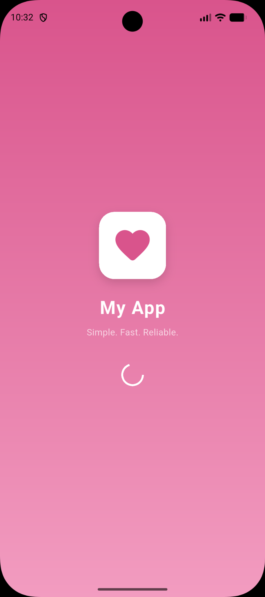</td>
<td>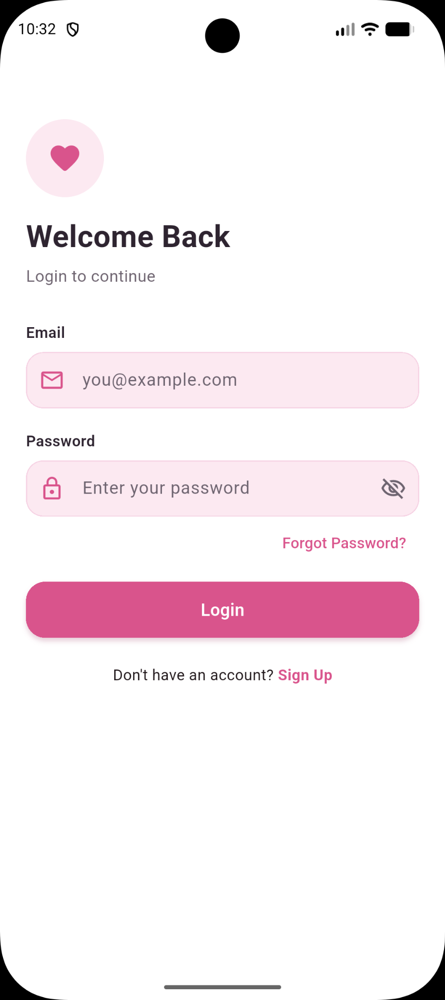</td>
<td>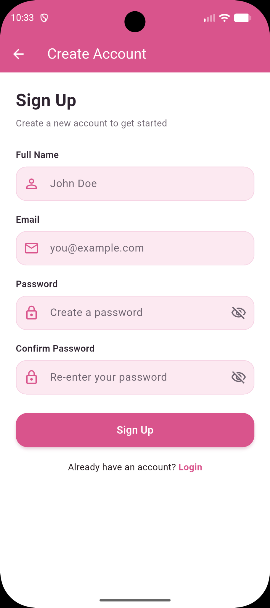</td>
<td>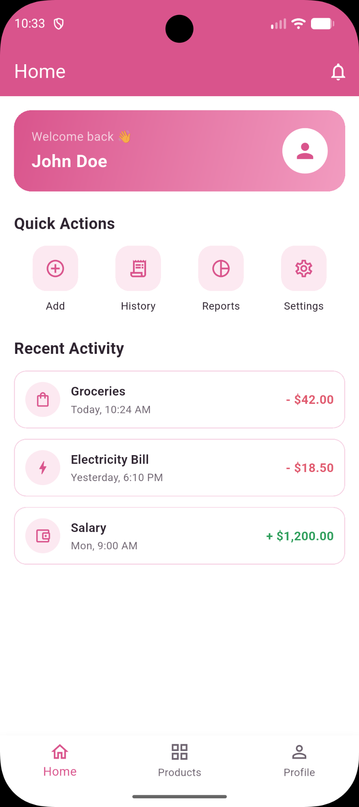</td>
</tr>
</table>

## Week 2 — Navigation & Reusable Widgets

Connected all the screens with actual navigation, then pulled out repeated UI into reusable widgets — `CustomButton`, `CustomTextField`, and `ProductCard`. Also added a bottom nav bar (Home / Products / Profile) and reorganized the project into proper folders instead of dumping everything in one place.

<table>
<tr>
<td>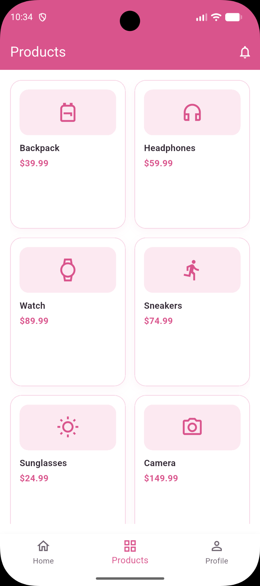</td>
<td>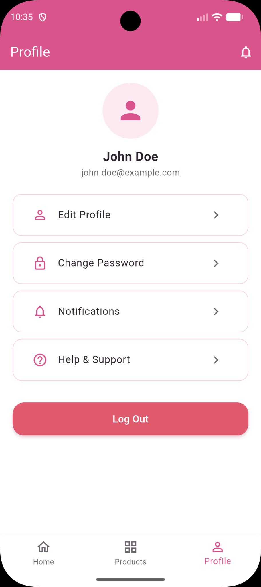</td>
</tr>
</table>

## Week 3 — CRUD & Local Data

Built a To-Do list with the usual CRUD stuff — add, edit, delete, mark as complete — displayed with `ListView.builder`. Started with plain `setState()` and then moved the task list over to `Provider` so it's easier to manage from different screens without passing callbacks everywhere.

<table>
<tr>
<td>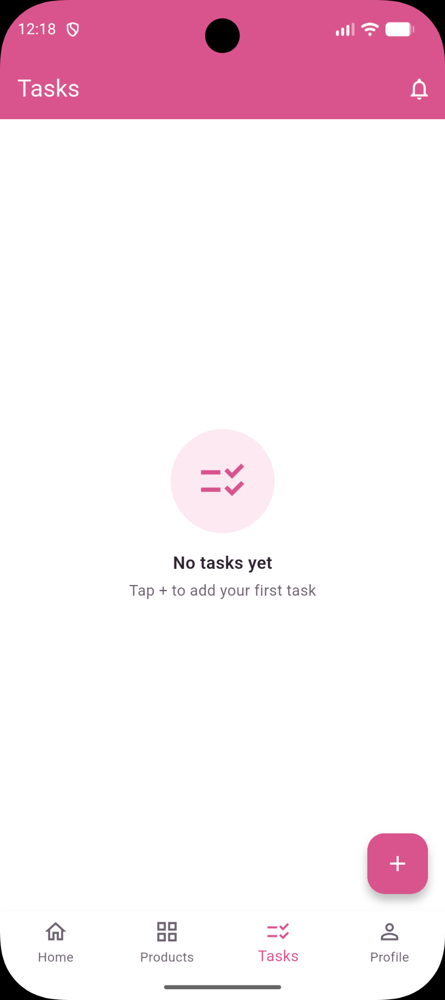</td>
<td>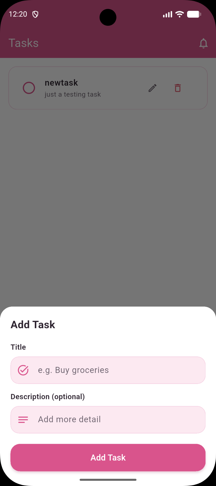</td>
<td>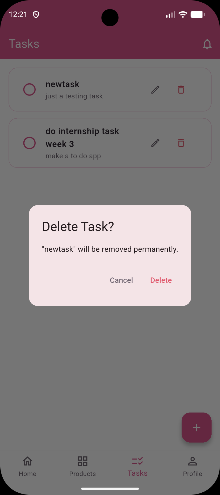</td>
<td>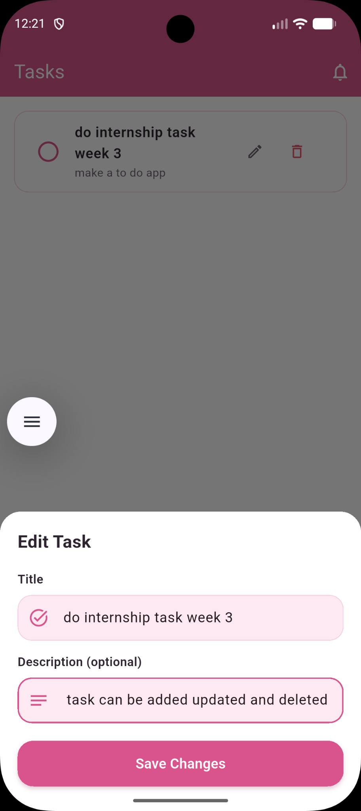</td>
</tr>
</table>

## Week 4 — Weather App (API Integration)

Last week — a mini weather app that hits the OpenWeatherMap API. You can search a city and it shows the temperature, condition, and icon. It handles the boring-but-important parts too: a loading state while it's fetching, and proper error messages (city not found, no internet, etc.) instead of just crashing or showing nothing.

<table>
<tr>
<td>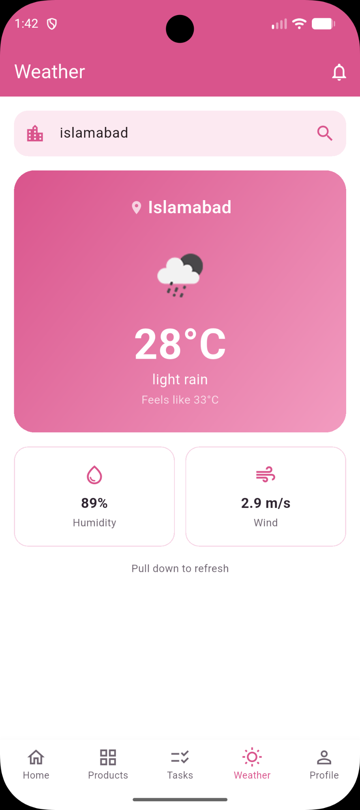</td>
<td>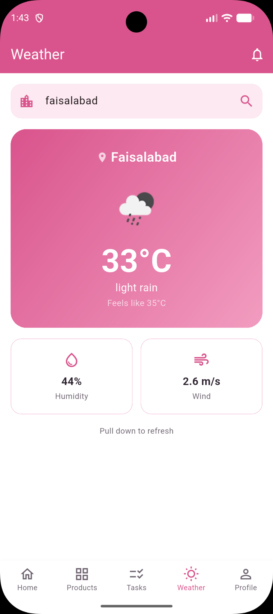</td>
<td>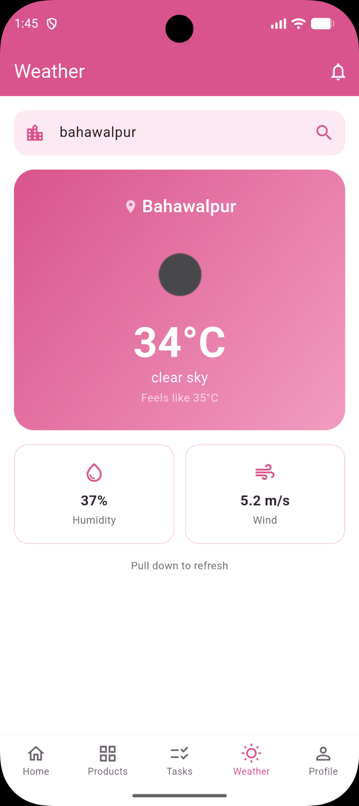</td>
<td>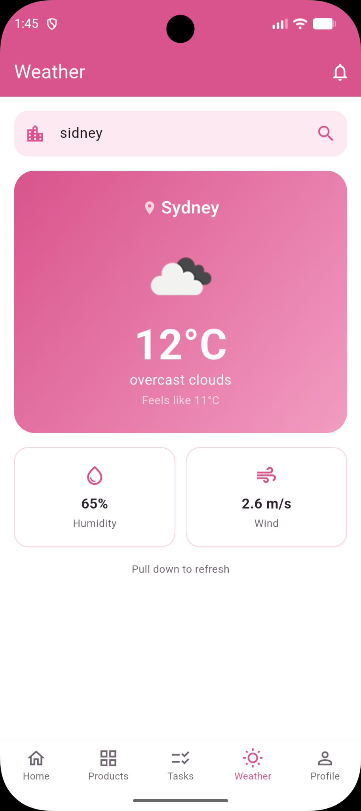</td>
</tr>
</table>
